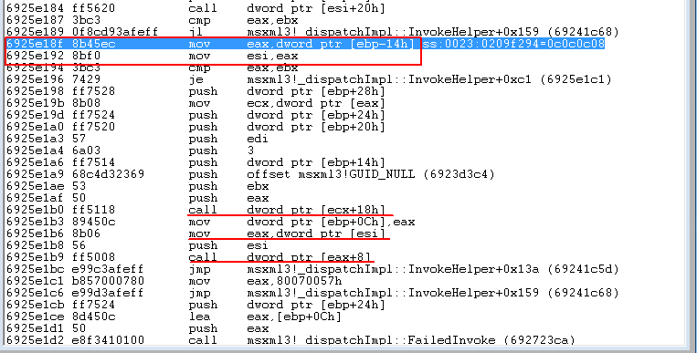

# CVE-2012-1889
## 实验环境
- Windows 7 专业版 32位
- IE 8
- WinDbg + mona

## 分析
漏洞成因: 未正确初始化栈上的一个局部变量

给`msxml3!_dispatchImpl::InvokeHelper`函数下断点: `bp msxml3!_dispatchImpl::InvokeHelper`. 在最后一次调用时跟踪到这里:

1. 通过缓冲区溢出将`[ebp-14h]`覆盖成`0c0c0c08`, 那么: `mov eax,[ebp-14h]` -> `(eax)=0c0c0c08`, `mov esi, eax` -> `(esi)=0c0c0c08`
2. `[0c0c0c08] = 0c0c0c0c`, 那么: `mov ecx,[eax]` -> `(ecx)=0c0c0c0c`
3. `call [ecx+18h]` -> `call [0c0c0c24]` -> `(eip)=[0c0c0c24]` -> 如果**在`0c0c0c24`地址处放一个`ret`指令的地址**, 就会转移到`ret`指令, 结果自然是返回后继续执行下一条指令;
4. `mov eax,[esi]` -> `mov eax,[0c0c0c08]` -> `(eax)=0c0c0c0c`
5. `call [eax+8]` -> `call [0c0c0c14]` -> `(eip)=[0c0c0c14]` -> **在`0c0c0c14`地址处放上`# xchg eax, esp # ret`指令的地址**, 则执行`xchg eax, esp`后`(esp)=(eax)=0c0c0c0c`, 接着执行`ret`时就会从`[esp]`——即`[0c0c0c0c]`处取指令, 所以需要**在`0c0c0c0c`地址处放一个`ret`指令的地址**, 并**在`0c0c0c10`地址处放上`# pop ebp # ret`指令的地址, 通过`pop`跳过4字节, 再把`0c0c0c24`之前的内容都填充成`ret`指令的地址**, 然后就会一路下滑到mona生成的ROP chain, 接着调用`VirtualAlloc()`、执行shellcode. (ROP chain和shellcode的详细分析在[这里](https://github.com/l-iberty/simple_overflow))

## 其他
- `doc/CVE-2012-1889.pdf` 来自网络
- `tool/gen_shellcode` 生成shellcode的C程序
- 问题: 触发缓冲区溢出漏洞的js代码的原理是什么?
